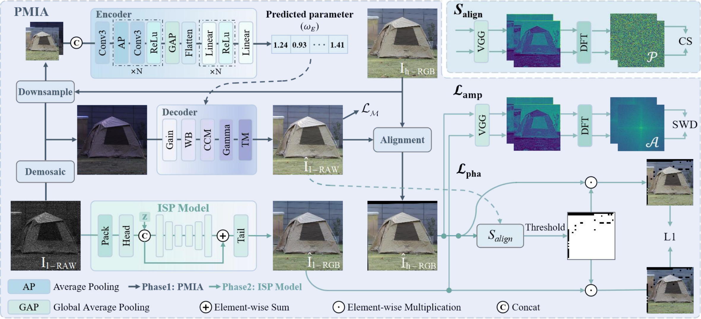

# Learning Deep ISP for High-Speed Cameras:Achieving DSLR-Quality Imaging under High Frame Rates

This repository contains the official implementation of the following paper:
> Learning Deep ISP for High-Speed Cameras:Achieving DSLR-Quality Imaging under High Frame Rates<br>
> Huaian Chen, Tianle Liu, Yi Jin, etc.<br/>


> Examples from the captured RHID dataset. (a) Visualized RAW input. (b) Output of the proposed method. (c) Reference (ground-truth) image captured by a DSLR camera.



> Overview of the proposed MisISP framework. The encoder and decoder together constitute the prior-informed image mapper, which is initially trained to minimize the discrepancy between the RAW image and the corresponding reference image. Subsequently, a pre-trained optical flow estimator is employed to align the reference image with the RAW input. Finally, the ISP model is optimized using the proposed loss functions, i.e., $\mathcal{L}{\text{pha}}$ and $\mathcal{L}{\text{amp}}$. In the encoder, “Conv3” denotes a convolutional layer with a 3×3 kernel, “ReLU” refers to the rectified linear unit activation function, “Flatten” denotes the operation that flattens multi-dimensional inputs into a one-dimensional vector, and “Linear” represents a fully connected layer. The default value of the parameter $N$ is set to 3. In the decoder, Gain, WB, CCM, Gamma, and TM denote prior-guided transformation functions for brightness adjustment, white balancing, color correction, gamma transformation, and tone mapping, respectively. All these modules are differentiable. The ISP model can be any existing deep learning-based ISP method, which typically includes a “Pack” module for rearranging the R, G, and B channels, a “Head” module for shallow feature extraction, and a “Tail” module for final sRGB image reconstruction. Once trained, the ISP model can be independently deployed for inference.

## Installation
The code has been tested with PyTorch 1.13 and Cuda 11.3.
```Shell
