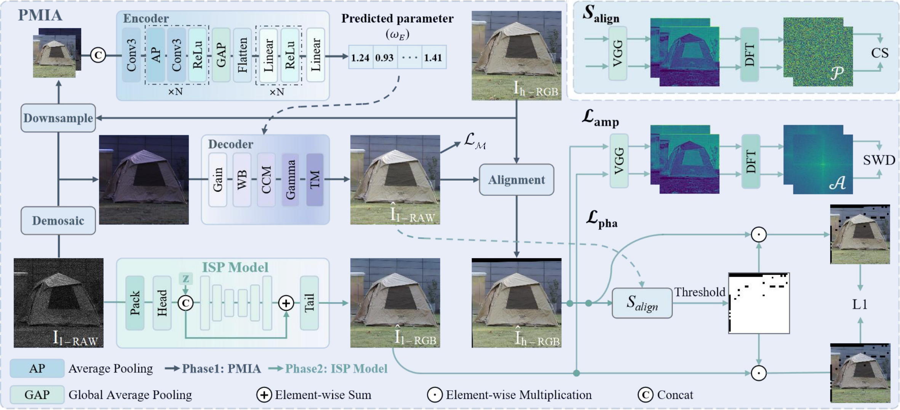

# Learning Deep ISP for High-Speed Cameras:Achieving DSLR-Quality Imaging under High Frame Rates

This repository contains the official implementation of the following paper:
> Learning Deep ISP for High-Speed Cameras:Achieving DSLR-Quality Imaging under High Frame Rates<br>
> Huaian Chen, Tianle Liu, Yi Jin, et al.<br/>


> Examples from the captured RHID dataset. From top to bottom: visualized RAW input, output of the proposed method, and ground-truth reference captured by a DSLR camera.



> Overview of the proposed MisISP framework. The encoder and decoder together constitute the prior-informed image mapper, which is initially trained to minimize the discrepancy between the RAW image and the corresponding reference image. Subsequently, a pre-trained optical flow estimator is employed to align the reference image with the RAW input. Finally, the ISP model is optimized using the proposed loss functions, i.e., $\mathcal{L}{\text{pha}}$ and $\mathcal{L}{\text{amp}}$. In the encoder, “Conv3” denotes a convolutional layer with a 3×3 kernel, “ReLU” refers to the rectified linear unit activation function, “Flatten” denotes the operation that flattens multi-dimensional inputs into a one-dimensional vector, and “Linear” represents a fully connected layer. The default value of the parameter $N$ is set to 3. In the decoder, Gain, WB, CCM, Gamma, and TM denote prior-guided transformation functions for brightness adjustment, white balancing, color correction, gamma transformation, and tone mapping, respectively. All these modules are differentiable. The ISP model can be any existing deep learning-based ISP method, which typically includes a “Pack” module for rearranging the R, G, and B channels, a “Head” module for shallow feature extraction, and a “Tail” module for final sRGB image reconstruction. Once trained, the ISP model can be independently deployed for inference.

## Installation
The code has been tested with PyTorch 1.12.1 and Cuda 11.3.
Follow these intructions to make conda environment and install dependencies:
```Shell
git clone https://github.com/TIANLE233/RHID_code.git
cd RHID_code
conda create -n rhid python=3.9
conda activate rhid
conda install pytorch==1.12.1 torchvision==0.13.1 torchaudio==0.12.1 cudatoolkit=11.3
pip install -r requirements.txt
python setup.py develop
```

## Demos
You can demo a trained model on prepared images:
```Shell
bash basicsr/run.sh 0 4050 basicsr/infer.py basicsr/archs/LiteISPNet_arch.py basicsr/models/triplerawisp_model.py basicsr/data/triplerawisp_dataset.py options/task/RAWISP4_mask.yml options/expe/LiteISPNet/LiteISPNet_mask.yml infer.out
```
The results will be saved in `basicsr/results`.

## RHID Dataset
To train and test, you will need to download our RHID dataset.
**Download Links:** [[Baidu Netdisk](https://pan.baidu.com/s/1E4pi-ckMJnc68AMCN_vqKQ?)] The dataset will be publicly available with an access code upon paper acceptance. If you need to access the data beforehand, please contact us via email at anchen@ustc.edu.cn.

```Shell
RHID_dataset/
├── train/
│   ├── Revealer/
│   │   ├── set1/
│   │   ├── set2/
│   │   ├── set3/
│   │   ├── set4/
│   │   ├── set5/
│   │   └── set6/
│   └── Canon/
│       ├── 00000.png
│       ├── 00001.png
│       └── ...
├── val/
│   ├── Revealer/
│   │   ├── set1/
│   │   ├── set2/
│   │   ├── set3/
│   │   ├── set4/
│   │   ├── set5/
│   │   └── set6/
│   └── Canon/
│       ├── 00000.png
│       ├── 00001.png
│       └── ...
```

## test
Add the path of the test dataset to `RAWISP4_mask.yml`, then modify the settings in `run.sh` and `LiteISPNet_mask.yml`, and finally run:
```Shell
bash basicsr/run.sh 0 4060 basicsr/test.py basicsr/archs/LiteISPNet_arch.py basicsr/models/triplerawisp_model.py basicsr/data/triplerawisp_dataset.py options/task/RAWISP4_mask.yml options/expe/LiteISPNet/LiteISPNet_mask.yml test.out
```

## train
Add the path of the train dataset to `RAWISP4_mask.yml`, then modify the settings in `run.sh` and `LiteISPNet_mask.yml`, and finally run:
```Shell
bash basicsr/run.sh 0,1,2,3 4070 basicsr/train.py basicsr/archs/LiteISPNet_arch.py basicsr/models/triplerawisp_model.py basicsr/data/triplerawisp_dataset.py options/task/RAWISP4_mask.yml options/expe/LiteISPNet/LiteISPNet_mask.yml train.out
```

## Acknowledgments
This code is based on [BasicSR](https://github.com/XPixelGroup/BasicSR) and [FriedRiceLab](https://github.com/Fried-Rice-Lab/FriedRiceLab). For more details, please refer to `README.md` of them.

## Contact
This repository is maintained by [Tianle Liu](https://github.com/TIANLE233) (tleliu@mail.ustc.edu.cn) and [Huaian Chen](https://github.com/anchen507) (anchen@ustc.edu.cn). Should you have any problem, please contact them.
